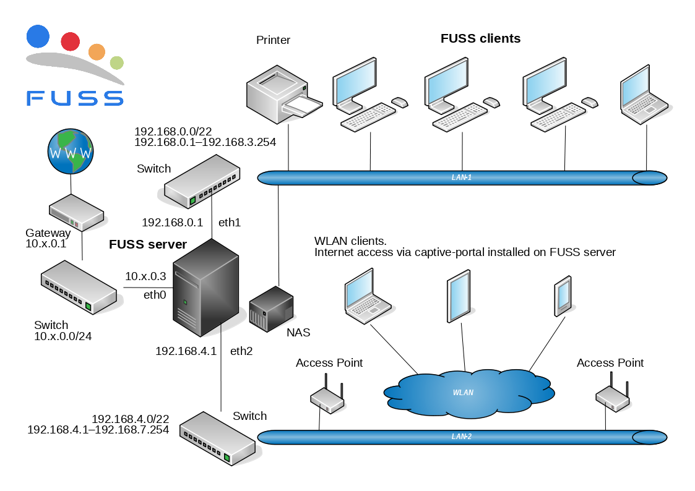

******************************
Guida rapida all'installazione
******************************

Questo capitolo è dedicato a chi vuole vedere velocemente come installare un server FUSS ed un client.

Topologia di una tipica rete didattica
======================================

Prima di mostrare come installare server e client, vediamo nella seguente figura la tipica topologia di rete dove FUSS può trovare applicazione.

    Tipica topologia di una rete FUSS

Un server FUSS deve avere almeno 2 interfacce di rete. La prima serve per la connessione alla WAN (Wide Area Network) mentre la seconda è collegata alla rete locale (LAN-1) della scuola. La presenza di una terza porta Ethernet sul server e di una seconda LAN nella scuola alla quale sono connessi degli access point WiFi sono i presupposti per poter installare sul server FUSS un captive-portal che offre la possibilità a dispositivi satellite di accedere ad internet previa autenticazione.

Installazione di FUSS server dal template cloud-init ready
==========================================================

A partire dalla versione 10 è disponibile una modalità di installazione più
veloce del FUSS server partendo da una immagine di macchina virtuale
preinstallata con il supporto per la tecnologia di autoconfigurazione
cloud-init.

Questa modalità può essere utilizzata solo con un sistema di virtualizzazione,
qui verrà illustrato come farlo con la piattaforma di virtualizzazione
Proxmox, adottata dal progetto, che supporta la tecnologia indicata
consentendo di gestire tutte le caratteristiche della macchina virtuale
direttamente dalla sua interfaccia web.

In particolare diventa possibile:

* gestire indirizzi di rete, gateway e DNS dall'interfaccia web
* gestire hostname e dominio dell'interfaccia web
* allargare automaticamente il disco radice una volta ridimensionato
  sull'interfaccia web

Installazione della macchina virtuale
-------------------------------------

Il primo passo è scaricare l'immagine predisposta dal progetto per
inserirla fra i dump disponibili per il ripristino. Questa è disponibile
all'indirizzo
http://iso.fuss.bz.it/cloud-init/vzdump-qemu-fuss-server-10-latest.vma.zst
e la cosa più semplice è scaricarla direttamente sul server Proxmox su
cui sarà utilizzata collegandosi con SSH ed eseguendo::

  # cd /var/lib/vz/dump/
  # wget http://iso.fuss.bz.it/cloud-init/vzdump-qemu-fuss-server-10-latest.vma.zst

.. note:: se si è configurato in Proxmox uno storage diverso da ``local`` per
	  le immagini dei dump ci si ponga nella rispettiva directory invece
	  che sotto ``/var/lib/vz/dump/``.

.. note:: le immagini più recenti sono compresse con il formato ``zstd`` ed il
	  file ha estenzione ``.zst``, alcune delle prime immagini (il cui uso
	  è comunque sconsigliato) sono in formato ``lzo`` ed hanno estensione
	  ``.lzo``.

Una volta completato il download l'immagine comparirà fra in contenuti
dello storage (dall'interfaccia web) e si potrà iniziare il ripristino
anche direttamente dall'interfaccia selezionandola ed usando il pulsante
"Restore" che creerà una nuova macchina virtuale sul primo VMID libero,
l'interfaccia comunque consente di indicarne uno specifico diverso. Si
abbia cura di indicare, sempre nella finestra di ripristino, l'uso di
``local-lvm`` come storage di ripristino e mettere la spunta sulla
casella "Unique".

Si tenga presente che perché questo funzioni regolarmente occorre avere
configurato Proxmox per l'uso di FUSS, la macchina virtuale infatti assume la
presenza di almeno due diverse interfacce di rete, una sulla rete esterna
(``vmbr0``) ed una sulla rete interna (``vmbr1``); qualora non fosse così si
potranno comunque cambiare le assegnazioni delle interfacce una volta
ripristinata la macchina virtuale.

Alternativamente si può eseguire il ripristino dalla riga di comando (si
assume che si sia configurato lo storage su LVM con il nome utilizzato nella
installazione di default di Proxmox) con::

  qmrestore /var/lib/vz/dump/vzdump-qemu-000-0000_00_00-00_00_00.vma.zst \
     106 -storage local-lvm -unique

dove al posto di ``106`` si può usare un qualunque VMID libero. Lo storage
deve essere local-lvm (come l'installazione diretta) e l'uso di ``-unique``
consente di generare un MAC address della nuova VM che non confligga con altri
eventualmente presenti (è poco probabile, a meno che non si reistallino più
machine dalla stessa immagine di partenza, ma è buona norma farlo).

Una volta ripristinata l'immagine gli si deve associare l'immagine del disco
di configurazione con::

  qm set 106 --ide2 local-lvm:cloudinit

.. note:: se si ottiene un errore del tipo::

	     lvcreate 'pve/vm-106-cloudinit' error:   Logical Volume "vm-106-cloudinit" already exists in volume group "pve"

	  si rimuova la precedente istanza del volume logico con::

	     lvremove pve/vm-106-cloudinit

	  e si ripeta il comando.

A questo punto prima di avviare la macchina per la prima volta si potrà 
configurare la rete dall'interfaccia web, nella sezione *Cloud-Init*,
impostando: gli IP sulle interfacce di rete, il default gateway per
l'interfaccia esterna, una chiave SSH di accesso a root, il dominio ed il
server DNS. Quest'ultimo deve essere sempre ``127.0.0.1``, ed il nome a
dominio dovrà essere quello che verrà poi utilizzato nella configurazione
finale eseguita dal comando ``fuss-server``.

.. warning:: si deve **sempre** configurare il server DNS come ``127.0.0.1`` e
   il nome a dominio uguale a quello che verrà usato poi con il comando
   ``fuss-server`` altrimenti si rischia che in una successiva esecuzione di
   ``fuss-server``, o nella riesecuzione dell'inizializzazione di cloud-init,
   ci siano interferenze e sovrascritture reciproche

Tutte queste operazioni si possono fare anche a riga di comando; per inserire
i suddetti parametri nelle configurazioni di ``cloud-init`` (si adattino gli
indirizzi di rete alle proprie esigenze) si esegua::

  qm set 106 --ipconfig0 ip=10.0.101.79/24,gw=10.0.101.1
  qm set 106 --ipconfig1 ip=192.168.0.1/24
  qm set 106 --searchdomain fusslab.blz
  qm set 106 --nameserver 127.0.0.1
  qm set 106 --sshkey ~/.ssh/id_rsa.pub

l'ultimo comando, se si ha un elenco di chiavi, può essere sostituito da::

  qm set 106 --sshkey elencochiavissh.txt

dove ``elencochiavissh.txt`` è un file contenente l'elenco di chiavi pubbliche
(una per riga) che verranno abilitate per la macchina in questione; lo si può
generare da un elenco di file di chiavi con qualcosa tipo ``cat *.pub >
elencochiavissh.txt``. 

Oltre alla configurazione della rete è opportuno impostare dall'interfaccia
web anche l'hostname della macchina. Questa corrisponde di default al nome
usato da Proxmox per la relativa VM (quello mostrato insieme al VMID
nell'interfaccia). Nell'immagine distribuita si è usato come nome di default
``fuss-server-base-image`` che si potrà modificare nella sezione *Options*
dell'interfaccia web. Anche in questo caso la modifica si può fare a riga di
comando con::
  
  qm set 106 --name serverhostname

.. warning:: benché sia possibile impostare l'hostname della macchina in un
	     secondo tempo all'interno della stessa con ``hostnamectl``, dato
	     che la configurazione iniziale della rete viene gestita comunque
	     da cloud-init, è opportuno configurare l'hostname direttamente in
	     questa sezione e verrà correttamente propagato anche nelle varie
	     configurazioni.

.. warning:: si tenga presente che se si cambia uno qualunque di questi
	     parametri in un secondo tempo, **tutte** le configurazioni da lui
	     gestite verranno rigenerate da cloud-init al successivo
	     riavvio. Questo comprende anche le chiavi SSH del server, con la
	     conseguenza che le precedenti non saranno più valide; per cui se
	     ci si è già collegati alla macchina si otterrà il solito avviso
	     che le fingerprint delle chiavi del server non corrispondono, e
	     sarà necessario rimuoverele e riaccettarle da capo.

Si dovranno inoltre modificare i parametri hardware della macchina virtuale
(dalla omonima sezione *Hardware* nell'interfaccia web), per aumentare la
memoria ed allargare il disco quanto necessario, ed eventualmente aggiungere
le interfacce di rete mancanti (ad esempio quella per il captive portal). Si
dovrà anche abilitare l'accensione automatica della macchina virtuale
all'avvio, dalla sezione *Options*.  Anche per modificare queste
caratteristiche si può continuare ad operare direttamente a riga di comando,
con qualcosa del tipo::

  qm set 106 --memory 4096
  qm set 106 --onboot 1
  qm resize 106 scsi0 500G

dove si aumenta la RAM assegnata alla macchina virtuale a 4G, si richiede il
lancio automatico al riavvio di Proxmox, e si allarga il disco a 500G. Se però
si decide di dedicare un disco separato per le home quest'ultima operazione
non deve essere eseguita, a meno che i 32G assegnati nell'immagine di default
al disco della radice risultino insufficienti, nel qual caso comunque la si
esegua con una dimensione opportuna.

Le immagini fornite hanno già attivato il discard sul disco di installazione
(quest'ultima opzione ha senso solo se, come nell'esempio, si ha un disco che
è stato estratto da uno storage che supporta il discard, come LVM-thin),
qualora fosse assente o non necessario lo si può attivare/disattivare
rispettivamente con::

  qm set 106 --scsi0 local-lvm:vm-106-disk-0,discard=on
  qm set 106 --scsi0 local-lvm:vm-106-disk-0,discard=off

Si tenga presente che le opzioni indicate verranno applicate al successivo
riavvio, anche per la parte di allargamento del disco, che verrà eseguita
automaticamente da ``cloud-init`` (con l'avvertenza però che questo è
possibile solo grazie allo specifico partizionamento usato dall'immagine
fornita dal progetto).

Alla fine del primo avvio della macchina virtuale vengono mostrate nella
console (accessibile dall'interfaccia web di Proxmox) le fingerprint delle
chiavi generate per il server SSH, che è possibile usare per verificarne la
correttezza alla prima connessione. Le si possono trovare in un secondo tempo
nel file ``/var/log/cloud-init-output.log``.

Configurazioni post-installazione
---------------------------------

Una volta finita l'installazione non è in genere necessario eseguire nessuna
altra configurazione, a meno di non avere necessità di mantere le home su un
disco separato, che è una buona pratica qualora serva mantenere le quote
disco, e che consentirà , in futuro, di eseguire un aggiornamento solo per la
parte di sistema, senza dover reinstallare i file nella home.

Si perde però in questo caso la capacità di avere un ridimensionamento
automatico del disco come avviene per il filesystem di root, in quanto
cloud-init gestisce questa funzionalità solo per quest'ultimo. Essendoci pro e
contro si lascia la valutazione dell'uso delle home separate a chi esegue
l'installazione, tratteremo comunque qui le modalità per configurare le home
su disco separato.

Creazione di un disco aggiuntivo per le home
^^^^^^^^^^^^^^^^^^^^^^^^^^^^^^^^^^^^^^^^^^^^

Per installare le home su un disco separato si provveda ad aggiungere un disco
di dimensione opportuna alla macchina virtuale dall'interfaccia web (sezione
"Hardware", "Add->Hard Disk"). Si può eseguire la stessa operazione dalla riga
di comando con qualcosa del tipo::

  pvesm alloc local-lvm 106 '' 100G
  qm set 106 --scsi1 local-lvm:vm-106-disk-1,discard=on

(di nuovo l'opzione ``discard=on`` ha senso solo se si usa uno storage come
``local-lvm``).

A questo punto una volta avviato il server disco verrà visto all'avvio come
``/dev/sdb``.  Ci si colleghi come root e si verifichi che il disco sia
effettivamente riconosciuto come ``/dev/sdb``; a questo punto lo si dovrà 
partizionare e creare il filesystem per le home, questo si può fare con::

  echo "start=2048, type=83" | sfdisk /dev/sdb
  mkfs.ext4 /dev/sdb1
  
si recuperi l'UUID del disco e lo aggiunga a ``/etc/fstab``, questo si può
fare con::

  echo -e "# /home was on /dev/sdb1 during installation" >> /etc/fstab
  echo -e "$(blkid -o export /dev/sdb1|grep ^UUID=) /home  ext4  defaults,grpquota,usrquota  0  2" >> /etc/fstab

Si sostituisca ``/dev/sdb1`` con l'opportuno file di dispositivo se se ne è
usato un altro. A parte l'aggiunta di un commento esplicativo il comando
estrae l'UUID del filesystem appena creato e crea una voce corretta per le
home con le opzioni per avere le quote e il giusto numero di sequenza nella
scansione iniziale del filesystem check.

Una volta verificato che nella installazione di cloud-init non ci siano file o
directory sotto ``/home`` (potrebbe restare la home dell'utente ausiliario di
installazione ``debian``, che può essere rimosso con ``userdel -r debian``) si
potrà montare il disco home con ``mount -a``.

Configurazione iniziale per le quote 
^^^^^^^^^^^^^^^^^^^^^^^^^^^^^^^^^^^^

Sia che si sia usato un disco aggiuntivo per ``/home``, sia che si siano
attivate successivamente le quote sulla radice (aggiungendo
``grpquota,usrquota`` alla sua voce in ``/etc/fstab``) è necessario
inizializzare le quote con::

  quotacheck -a -f
  quotacheck -ag -f

dove l'opzione ``- f`` è necessaria qualora (come avviene se si aggiungono le
opzioni di mount per le quote sulla radice) per forzare la scrittura dei file
delle quote a sistema attivo. Si possono ignorare gli avvertimenti che i dati
potrebbero essere imprecisi, verranno comunque corretti al primo riavvio.

Una volta attive le quote si potranno usare i comandi ``repquota`` e
``repquota -g`` per verificare la effettiva presenza delle quote. Se detti
comandi non sono presenti si possono installare con ``apt install quotatool``
(sono stati comunque inclusi nell'immagine di cloud-init).

Se non si riavvia la macchina dopo aver eseguito i comandi precedenti ed
attivato le quote nelle opzioni di montaggio, o se si aggiungono le opzioni
``grpquota,usrquota`` in un secondo tempo rimontando il filesystem, e si forza
il calcolo delle quote a filesystem montato usando anche l'opzione ``-m`` con
i due comandi precedenti, occorrerà anche attivare le quote esplicitamente
con::
 
    quotaon -a

.. _installazione-fuss-server:

Installazione di FUSS server tradizionale
=========================================

Per installare FUSS Server su una macchina fisica, è necessario partire
da un'installazione di Debian Buster, su cui è basato il FUSS server.
Le immagini si possono ottenere dall'indirizzo

https://cdimage.debian.org/debian-cd/current/amd64/iso-cd/

e a febbraio 2020 la versione più recente è la 10.3.0, quindi il file da
utilizzare è ``debian-10.3.0-amd64-netinst.iso``.

Per le :ref:`installazioni nelle scuole di Bolzano
<installazioni-scuole-bolzano>` quest'immagine andrà :ref:`caricata sul
server proxmox <caricare-iso-su-proxmox>` precedentemente configurato,
proseguendo quindi con la creazione della macchina virtuale fino al boot
della stessa. Ma in questo caso è preferibile utilizzare la procedura
illustrata nel paragrafo precedente.

Per installare invece direttamente sul server è necessaria una
chiavetta USB della capacità minima di 1 GB sulla quale va copiata
l'immagine ISO scaricata. In GNU/Linux si può usare il comando ``dd``.
Dopo aver inserito la chiavetta nel PC ove è disponibile l'immagine,
verificare con il comando ``lsscsi`` quale dispositivo è stato assegnato alla
chiavetta. Nell'esempio usiamo ``/dev/sdX`` dove X può essere una delle
lettere ``a``, ``b``, ``c`` ecc.  Come root, dare il comando::

   # dd if=/PERCORSO_IMMAGINE/fuss-server-8.0-amd64-201708221233.iso \
     of=/dev/sdX bs=4M status=progress

Preparata la chiavetta USB, inserirla nel server e dopo averlo avviato
premurarsi di scegliere come dispositivo di boot la chiavetta stessa.

Installazione di Debian
-----------------------

Configurazioni iniziali
^^^^^^^^^^^^^^^^^^^^^^^

Se si è correttamente configurato l'avvio della macchina virtuale dalla ISO
del Netinstall si otterrà la seguente schermata iniziale:

.. figure:: /installazioni_specializzate/images/netinstall-boot.png

si scelga una installazione testuale, verranno chieste nell'ordine la lingua:

.. figure:: /installazioni_specializzate/images/netinstall-langsel.png

e si scelga l'italiano; la posizione (per il fuso orario):

.. figure:: /installazioni_specializzate/images/netinstall-posizione.png

e si scelga Italia; la tastiera:

.. figure:: /installazioni_specializzate/images/netinstall-keyboard.png

e si scelga quella italiana.

Per la rete si usi come interfaccia per l'installazione quella corrispondente
alla WAN del server (quella che si affaccia su Internet):

.. figure:: /installazioni_specializzate/images/netinstall-ifselect.png

l'installer tenterà la configurazione automatica della rete, che deve essere
interrotta (si prema invio durante l'acquisizione per cancellarla, o si torni
indietro qualora sia avvenuta). In questo modo si potrà selezionare
esplicitamente una configurazione manuale per l'IP "esterno" del fuss-server:

.. figure:: /installazioni_specializzate/images/netinstall-manualnet.png

e si effettuino le impostazioni standard della rete (indirizzo IP, netmask e
default gateway e DNS):

.. figure:: /installazioni_specializzate/images/netinstall-configip.png
.. figure:: /installazioni_specializzate/images/netinstall-configgw.png
.. figure:: /installazioni_specializzate/images/netinstall-configdns.png

Verrà poi chiesto il nome della macchina, si inserisca subito quello
definitivo:

.. figure:: /installazioni_specializzate/images/netinstall-sethostname.png

si prosegua poi impostando il dominio:

.. figure:: /installazioni_specializzate/images/netinstall-setdomain.png

verranno poi chieste la password di root e l'utente iniziale, da impostare a
piacere.

Si dovrà poi effettuare il partizionamento dei dischi per l'installazione del
sistema.

La scelta più sicura, per evitare problemi di riempimento della radice,
è usare filesystem separati per ``/home``, ``/var``, ``/tmp``. Questo
però con il partizionamento diretto rende meno flessibile la eventuale
riallocazione dello spazio disco.

Si tenga presente infatti che anche avendo disponibile spazio disco per
poter allargare le partizioni, l'allargamento avverrebbe sul "fondo"
pertanto sarebbe facile ridimensionare soltanto l'ultima partizione (nel
caso la ``/home``, che pur essendo quella più probabile, non è detto sia
davvero quella che ha bisogno dello spazio disco aggiuntivo).

Per questo si suggerisce, per avere maggiore flessibilità , al costo di
una leggera perdita di prestazioni in I/O, di installare usando LVM,
selezionando "guidato - usa l'intero disco e imposta LVM":

.. figure:: /installazioni_specializzate/images/fuss-server_scelta-guidato.png

quindi selezionare il disco da partizionare:

.. figure:: /installazioni_specializzate/images/fuss-server_selezione-disco.png

l'uso dei filesystem separati:

.. figure:: /installazioni_specializzate/images/fuss-server_selezione-partizioni.png

e confermare la configurazione di LVM:

.. figure:: /installazioni_specializzate/images/fuss-server_conferma-scelta.png

e l'uso di tutto lo spazio disponibile per il gruppo di volumi:

.. figure:: /installazioni_specializzate/images/fuss-server_gruppo-volumi.png

e poi la formattazione finale:

.. figure:: /installazioni_specializzate/images/fuss-server_scelta-finale.png

Una volta completato il partizionamento ed esaurita l'installazione del
sistema base verrà chiesto se aggiungere ulteriori CD o DVD, rispondere
di No:

.. figure:: /installazioni_specializzate/images/netinstall-ulteriori-cd.png

quindi alla richiesta di configurare i repository dei pacchetti, si
utilizzi il mirror più vicino, non sarà necessario, essendo sulla WAN,
utilizzare un proxy.

.. figure:: /installazioni_specializzate/images/netinstall-pacchetti.png
.. figure:: /installazioni_specializzate/images/netinstall-mirror.png
.. figure:: /installazioni_specializzate/images/netinstall-proxy.png

Si risponda come si preferisce alla richiesta di partecipare o meno alla
indagine del popularity contest, e nella selezione del software si scelgano
soltanto le voci "server SSH" e "utilità di sistema standard":

.. figure:: /installazioni_specializzate/images/netinstall-tasksel.png

e si completi l'installazione con GRUB installato sul Master Boot Record del
disco:

.. figure:: /installazioni_specializzate/images/netinstall-grubinstall.png
.. figure:: /installazioni_specializzate/images/netinstall-selectdisk.png

Completata l'installazione si riavvi il server, eventualmente rimuovendo
il CD di installazione e ripristinando l'ordine di avvio al boot.

Configurazioni post-installazione
^^^^^^^^^^^^^^^^^^^^^^^^^^^^^^^^^

Completata l'installazione di Debian occorre finalizzare le configurazioni
iniziali della macchina prima di poter lanciare ``fuss-server create``. Il
primo passo è configurare la seconda interfaccia di rete per la LAN, si dovrà 
modificare ``/etc/network/interfaces`` per aggiungere la relativa
configurazione con qualcosa del tipo::

  # lan
  allow-hotplug enp2s0
  iface enp2s0 inet static
        address 192.168.0.1
        netmask 255.255.255.0
        network 192.168.0.0

ed attivare l'interfaccia con ``ifup enp2s0``.

Occorrerà poi configurare le sorgenti software per i pacchetti,
aggiungendo in ``/etc/apt/sources.list`` le righe per il repository di
backports e per quello di FUSS::

  deb http://deb.debian.org/debian/ buster-backports main
  deb http://archive.fuss.bz.it/ buster main

infine si dovrà importare la chiave GPG del repository di FUSS con::

  # apt install gnupg
  # wget -qO - https://archive.fuss.bz.it/apt.key | apt-key add -
  # apt update

a questo punto si potrà installare il pacchetto del fuss-server::

  # apt install fuss-server

Una volta completata la configurazione iniziale della macchina, si potrà 
proseguire con la configurazione del fuss-server come già illustrato nella
sezione :ref:`configurazione-fuss-server`.

.. _installazione-fuss-client:

Installazione tradizionale di FUSS Client
=========================================

Si passa ora all'installazione del primo client.

Preparazione chiavetta USB
--------------------------

Come prima cosa è necessario scaricare l'ultima versione dell'immagine ISO live Xfce di Debian 10 "buster". Ad oggi (aprile 2022) l'ultima versione disponibile di "buster" è la 10.12.0 ed è possibile reperirla da `<https://cdimage.debian.org/mirror/cdimage/archive/latest-oldstable-live/amd64/iso-hybrid/>`_ per architettura amd64:

- `debian-live-10.12.0-amd64-xfce.iso <https://cdimage.debian.org/mirror/cdimage/archive/latest-oldstable-live/amd64/iso-hybrid/debian-live-10.12.0-amd64-xfce.iso>`_

E` necessaria una chiavetta USB con taglia  minima di almeno 4 GB sulla quale va copiata l'immagine ISO scaricata. Come detto anche sopra, in GNU/Linux si può usare il comando ``dd``. Dopo aver inserito la chiavetta nel PC ove è disponibile l'immagine, verificare con il comando ``lsscsi`` quale dispositivo è stato assegnato alla chiavetta. Nell'esempio usiamo ``/dev/sdX`` dove X può essere una delle lettere ``a``, ``b``, ``c`` ecc.
Nell'ipotesi che la ISO scaricata si per architettura amd64, come root, dare il comando

.. code-block:: console

   dd if=/PERCORSO_IMMAGINE/debian-live-10.12.0-amd64-xfce.iso of=/dev/sdX bs=4M status=progress

Preparata la chiavetta USB, inserirla nel PC/notebook e dopo averlo avviato premurarsi di scegliere come dispositivo di boot la chiavetta stessa.

Procedura di installazione guidata
----------------------------------

Per immagini viene mostrata di seguito la procedura di installazione del primo client. Si è scelto l'installer da console (Debian Installer). In alternativa si può optare per l'installer grafico (Graphical Debian Installer).

.. note:: Se si vuole utilizzare FUSS in modalità `LIVE`, si scelga la prima opzione. Le credenziali dell'utente di default sono ``user`` - ``live``.

.. figure:: images/fuss-client_01.png

Scelta di lingua e tastiera.

.. figure:: images/fuss-client_02.png

.. figure:: images/fuss-client_03.png

.. figure:: images/fuss-client_04.png

Inserire il nome del host.

.. figure:: images/fuss-client_05.png

Il dominio interno nel quale si colloca il host, come definito durante l'installazione del server.

.. figure:: images/fuss-client_06.png

Impostazione della password di root.

.. figure:: images/fuss-client_07.png

.. figure:: images/fuss-client_09.png

Creazione di un utente locale.

.. figure:: images/fuss-client_10.png

.. figure:: images/fuss-client_11.png

.. figure:: images/fuss-client_12.png

.. figure:: images/fuss-client_13.png

Partizionamento dei dischi. Si scelga il partizionamento manuale impostando una partizione di swap ed una per la radice (/ o root) del filesystem.

.. figure:: images/fuss-client_14.png

.. figure:: images/fuss-client_15.png

.. figure:: images/fuss-client_16.png

.. figure:: images/fuss-client_17.png

.. figure:: images/fuss-client_18.png

.. figure:: images/fuss-client_19.png

.. figure:: images/fuss-client_20.png

.. figure:: images/fuss-client_21.png

.. figure:: images/fuss-client_22.png

.. figure:: images/fuss-client_23.png

.. figure:: images/fuss-client_24.png

.. figure:: images/fuss-client_25.png

.. figure:: images/fuss-client_26.png

Al termine scrivere le modifiche sul disco.

.. figure:: images/fuss-client_27.png

Inizia l'installazione del sistema.

.. figure:: images/fuss-client_28.png

L'installer cerca i pacchetti nel CD-ROM di installazione che non esiste. Semplicemente ignorare l'errore e proseguire premendo :guilabel:`Continua`.

.. figure:: images/fuss-client_29.png

Scegliere un mirror di rete.

.. figure:: images/fuss-client_30.png

.. figure:: images/fuss-client_31.png

.. figure:: images/fuss-client_32.png

Impostare il proxy a ``http://proxy:8080`` dove ``proxy`` risponde al FUSS Server.

.. figure:: images/fuss-client_33.png

.. figure:: images/fuss-client_34.png

Installare il boot loader GRUB nel master boot record del disco sul quale si sta installando il sistema.

.. figure:: images/fuss-client_35.png

.. figure:: images/fuss-client_36.png

.. figure:: images/fuss-client_37.png

.. figure:: images/fuss-client_38.png

Al termine la macchina va riavviata.

Configurazione FUSS Client
--------------------------

Dopo il riavvio si acceda come root. La password preimpostata è ``fuss`` e si consiglia di cambiarla con il comando ``passwd``.

E` necessario configurare i repository FUSS. Abilitare pertanto sia i repository FUSS che `buster-backports` in ``/etc/apt/sources.list``:

.. code-block:: html

    deb http://archive.fuss.bz.it/ buster main
    deb http://httpredir.debian.org/debian buster-backports main

La sources.list dovrebbe pertanto risultare ad esempio:

.. code-block:: html

    # See https://wiki.debian.org/SourcesList for more information.
    deb http://deb.debian.org/debian buster main
    deb-src http://deb.debian.org/debian buster main

    deb http://deb.debian.org/debian buster-updates main
    deb-src http://deb.debian.org/debian buster-updates main

    deb http://security.debian.org/debian-security/ buster/updates main
    deb-src http://security.debian.org/debian-security/ buster/updates main

    # buster-backports
    deb http://httpredir.debian.org/debian buster-backports main

    deb http://archive.fuss.bz.it/ buster main

Se invece si ha la necessità di scaricare anche i pacchetti non-free si aggiungano a "main" anche "contrib" e  "non-free"

.. code-block:: html

    # See https://wiki.debian.org/SourcesList for more information.
    deb http://deb.debian.org/debian buster main contrib non-free
    deb-src http://deb.debian.org/debian buster main contrib non-free

    deb http://deb.debian.org/debian buster-updates main contrib non-free
    deb-src http://deb.debian.org/debian buster-updates main contrib non-free

    deb http://security.debian.org/debian-security/ buster/updates main contrib non-free
    deb-src http://security.debian.org/debian-security/ buster/updates main contrib non-free

    # buster-backports
    deb http://httpredir.debian.org/debian buster-backports main contrib non-free

    deb http://archive.fuss.bz.it/ buster main contrib non-free

.. note::
  Se si è dietro un FUSS server, perché sia possibile scaricare la chiave di
  firma di APT, occorre prima definire ``export https_proxy=http://proxy:8080``:

Installare, se non già presente, il pacchetto ``wget``:

.. code-block:: console

    apt update
    apt install wget
    
Aggiungere la chiave di firma del repository ``archive.fuss.bz.it`` e aggiornare con apt i pacchetti.

.. code-block:: console

    wget -qO - https://archive.fuss.bz.it/apt.key | apt-key add -
    apt update
    apt dist-upgrade

All'occorrenza aggiungere i pacchetti Debian necessari a seconda del contesto in cui viene installato il FUSS Client.

Creazione di un'immagine del client con Clonezilla
--------------------------------------------------

Al fine di velocizzare l'installazione del FUSS Client sui PC/notebook rimanenti, si consiglia di creare con Clonezilla un'immagine del primo FUSS Client. Il FUSS Server monta un'istanza di Clonezilla, eseguibile da qualsiasi macchina presente nella LAN via PXE Boot (network boot). Pertanto, riavviando il FUSS CLient appena creato e scegliendo l'opzione di boot "PXE Boot", verrà caricato Clonezilla dal server e sarà possibile creare un'immagine del primo client che verrà salvata nella cartella ``/var/clonezilla`` sul server. Clonezilla chiederà la password dell'utente clonezilla, che è memorizzata sul server nel file ``/root/clonezilla_cred.txt``.

Al termine della procedura di salvataggio del clone sul server, sarà possibile installare agevolmente nuovi client lanciando parimenti Clonezilla via network boot e scegliendo di fare il restore di un'immagine.

Ad ogni client va attribuito un nome di host diverso. E` necessario intervenire, pertanto, sui file ``/etc/hostname`` ed ``/etc/host`` riavviando al termine il client..

Join del client al server
-------------------------

Infine va effettuato il join del client al server lanciando da terminale il comando ``fuss-client`` come segue:

.. code-block:: console

    fuss-client -a

Come unica interazione viene chiesto, qualora configurato, a quale cluster associare il host (es: `aula-01`, `aula-insegnanti`, ecc.). Inoltre va inserita per tre volte la password di root del server.

Installazione con FUSS-FUCC 
============================
FUCC è l'acronimo di Fully Unattended Clonezilla Cloning

Compilazione della lista dei computer
-------------------------------------

Nella cartella ``/srv/clonezilla`` (normalmente cartella standard di clonezilla) o su altra cartella sul server FUSS che contiene la immagini da clonare, si trova il file ``computerList.txt`` in cui bisogna elencare i
**nomi** che si vogliono assegnare ai computer specificando il **mac-address** e **l'immagine di clonezilla** che si vuole installare sul computer.  Se si vuole agganciare il computer al dominio si deve aggiungere la parola **join** 
e, come ultimo parametro, il nome del **cluster**.   Il file incluso nel pacchetto contiene un piccolo esempio commentato che riportiamo di seguito:

::

    info-pc01 08:00:27:ab:5a:a2 cloneImage-img join clustername

La creazione del file ``/srv/clonezilla/computerList.txt`` può essere effettuata anche automaticamente lanciando lo script:

.. code:: bash

    fuss-fucc octolist NOME-IMMAGINE-CLONEZILLA

Viene creato il file **computerList.txt.octo-new** che può essere copiato al posto di ``/srv/clonezilla/computerList.txt``. Verificare che la lista contenga tutti i pc che si intende aggiornare.

In questo modo, se si reinstalla in modalità automatica, ai client vengono assegnati gli stessi hostname e cluster di prima.

Installazione del client
--------------------------

Una volta eseguito quanto sopra indicato si avviino in ``network boot(PXE)`` i PC da installare (in genere si preme il tasto ``F12`` ma potrebbe variare a seconda del computer). 
Il menu presenta due possibili scelte, **automatica** o **manuale** , come indicato nello screenshot seguente. La **modalità automatica è il default** ma richiede ovviamente che il file ``computerList.txt`` sia compilato correttamente.
In modalità automatica non occorre praticamente fare nulla, l'immagine viene copiata, il client viene rinominato e joinato alla rete come indicato in computerList.txt.

.. figure:: images/boot-menu.png
   :alt: clonezilla boot

   clonezilla boot

In caso contrario, o se qualcosa non va a buon fine, si può optare per l'installazione manuale. In tal caso il client carica clonezilla, ma per il resto si installa il client quasi come 
se si usasse una chiavetta, la partizione contenente le immagini viene montata previa autenticazione con password (si scelga ``skip`` al momento di scegliere la sorgente).
Clonata l'immagine bisognerà lanciare

 
::

    fuss-client -H <hostname> 

per rinominare il client ed agganciarlo al server.

Configurazione del cambio automatico della password di root
-------------------------------------------------------------

FUCC è in grado di modificare automaticamente la password di root dei client clonati con una criptata che gli viene passata. Per **configurare** il ``cambio password`` eseguire sul server lo script:

.. code:: bash

    fuss-fucc rootpw

ed inserire due volte la password di root da dare ai client. Di norma questo **script** dev'essere ovviamente eseguito **prima** di iniziare a clonare le macchine.

Accesso all'interfaccia di amministrazione OctoNet
--------------------------------------------------

Aprendo il browser da un qualsiasi PC/notebook della LAN all'indirizzo
`<http://proxy:13402>`_, è possibile accedere all'interfaccia OctoNet di
configurazione della rete didattica e da questa, tra le altre funzioni, si
possono creare le utenze della rete didattica. L'amministratore è l'utente
`root` e la password è la Master Password impostata durante l'esecuzione di
fuss-server.

Questa modalità però comporta che tutto il traffico passi in chiaro, pertanto
è fortemente sconsigliata, si utilizzi un tunnel SSH come illustrato nel
paragrafo dedicato all'uso di OctoNet, che non espone al rischio di
intercettazione delle credenziali di accesso.

Captive Portal
==============

L’installazione del captive portal deve essere effettuata una volta che
si sia correttamente installato il *Fuss Server* (secondo le istruzioni
di :ref:`installazione-fuss-server`). In particolare si suppone che
siano già correttamente configurate le interfacce di rete per la rete
interna (quella rivolta verso le macchine dell’aula) ed esterna (quella
da cui si accede ad internet).

Per poter utilizzare il *Captive Portal* è necessario disporre di una
terza interfaccia di rete che deve essere lasciata **non configurata**.
Questa interfaccia sarà quella che dovrà essere collegata fisicamente al
tratto di rete (che deve essere fisicamente separata dalla rete interna
del server) che verrà gestita dal *Captive Portal* (ad esempio vi si
potrà attaccare un access point senza autenticazione). Negli esempi
successivi assumeremo che si tratti di ``ens20``.

Si tenga presente che l’interfaccia fisica (``ens20``) viene gestita
direttamente dal software di gestione del *Captive Portal* (Coova
Chilli) che poi fa passare i pacchetti autorizzati creando una
interfaccia tunnel (di default ``tun0``). Gli indirizzi di rete fanno
riferimento a quest’ultima, ad ``ens20`` non deve essere assegnato alcun
indirizzo IP.

Per questo si abbia cura di verificare che sul *Fuss Server* non sia
stato attivato network manager in caso di installazione dell’interfaccia
grafica (il default comunque non lo prevede). Qualora risultasse
presente si abbia cura di bloccare ogni possibile tentativo di
autoconfigurazione dell’interfaccia dedicata al *Captive Portal*
inserendo in ``/etc/network/interfaces`` una voce del tipo::

   iface ens20 inet manual

Per installare il *Fuss Captive Portal* occorre eseguire il comando::

   fuss-server cp

che provvederà a richiedere, qualora non siano già definiti, i dati
necessari alla configurazione. Come per gli altri questi vengono
mantenuti nel file ``/etc/fuss-server/fuss-server.yaml`` In particolare
saranno richiesti:

-  interfaccia di rete su cui attestare la rete del *Captive Portal* (ad
   esempio ``eth2``)
-  indirizzo della rete del *Captive Portal* (ad esempio
   ``10.1.0.0/24``)

Un esempio di sessione di installazione è il seguente::

   root@fuss-server-iso:~# fuss-server cp
   ################################################################################
   Please insert Hot Spot Interface

   The Hotspot interface of the server, ex. 'eth3'
   Your choice? ens20
   ################################################################################
   Please insert Hot Spot Network (CIDR)

   The Hotspot network of the server, ex. '10.1.0.0/24'
   Your choice? 10.1.0.0/24
   ...

.. note::
   Si tenga presente che nel file ``/etc/fuss-server/fuss-server-defaults.yaml`` 
   la variabile ``chilli_range_split`` è impostata di default a ``yes`` 
   e pertanto quando si configura il captive portal la rete di coova-chilli 
   viene separata in un range dinamico ed un range statico. Quello statico viene
   destinato tipicamente agli access-point. 
   In relazione al numero di device che dovranno essere serviti è opportuno 
   usare un ``hotspot_network`` adeguato. Ad esempio se si sceglie ``10.1.0.0/23`` 
   il range dinamico sarà ``10.1.0.2--10.1.0.254`` mentre quello statico 
   ``10.1.1.1--10.1.1.254``. 

Il software del *Captive Portal* autentica gli utenti su LDAP (occorre
quindi avere un utente definito per poterlo provare), e consente solo
agli utenti autenticati di uscire, passando attraverso un secondo proxy,
sulle porte 80 e 443

Per il funzionamento del *Captive Portal* viene creato dal comando di
installazione anche il file ``fuss-captive-portal.conf`` che contiene le
variabili necessarie allo script di firewall per gestire gli accessi
relativi al *Captive Portal*, questo file non deve essere modificato né
cancellato, altrimenti il riavvio del firewall non aprirà gli accessi
necessari al funzionamento del *Captive Portal*.

.. note::
   l’installazione del captive portal aggiunge il gruppo ``wifi`` (si
   vedano a tal proposito i due file ``/etc/group`` ed
   ``/etc/octofuss/octofuss.conf``). Di default gli utenti di una rete
   scolastica non appartengono al gruppo ``wifi`` e pertanto non hanno
   l’autorizzazione per accedere al captive portal; devono essere
   esplicitamente autorizzate in OctoNet.

Accesso alla rete wifi tramite *Captive Portal*
-----------------------------------------------

Una volta connessi alla rete dell'access point, per navigare è necessario inserire le proprie credenziali nella finestra di login del *Captive Portal*,
a cui si accede aprendo il browser e inserendo nella barra di navigazione l'indirizzo ``<http://10.1.0.1:4990>`` .
Poiché il *Captive Portal* memorizza MAC address della macchina e lo conserva per qualche tempo, prima di chiudere la sessione è consigliabile inserire nella barra di navigazione l'indirizzo ``<http://10.1.0.1:4990/logoff>``, ``<http://logout>`` o semplicemente ``logout``.
In caso contrario l'utente successivo potrebbe navigare in rete usando le nostre credenziali.

..  LocalWords:  FUSS client images WAN Wide ethernet access point WiFi fuss
..  LocalWords:  portal Buster ref bolzano proxmox iso USB GB dd lsscsi root
..  LocalWords:  if of bs progress Netinstall l'installer netmask gateway DNS
..  LocalWords:  filesystem home var tmp riallocazione LVM repository mirror
..  LocalWords:  proxy popularity contest SSH GRUB lan allow hotplug enp inet
..  LocalWords:  iface static address ifup backports deb buster main GPG wget
..  LocalWords:  qO apt key add update install amd block notebook Installer
..  LocalWords:  Graphical LIVE live host swap guilabel loader passwd stretch
..  LocalWords:  html https dist upgrade Clonezilla PXE CLient clonezilla eth
..  LocalWords:  restore Join join OctoNet Coova Chilli tun manual cp Please
..  LocalWords:  insert Hot Interface The Hotspot interface the Your choice
..  LocalWords:  CIDR LDAP conf firewall wifi dell'access MAC cloud init dump
..  LocalWords:  storage local VMID vmbr qmrestore lvm unique qm ide image ip
..  LocalWords:  cloudinit already exists warning Options ipconfig gw fusslab
..  LocalWords:  searchdomain blz nameserver sshkey elencochiavissh cat scsi
..  LocalWords:  memory resize onboot
